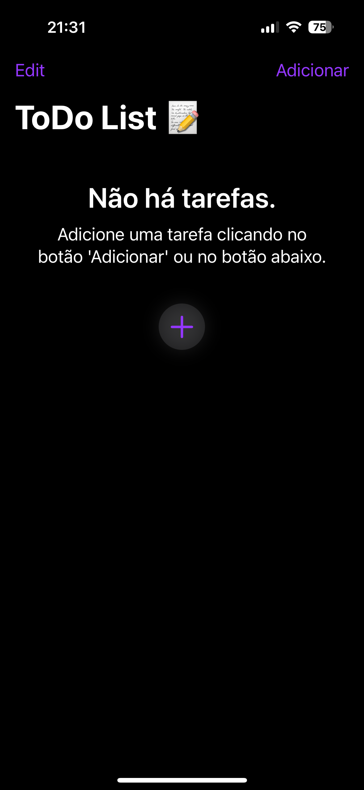
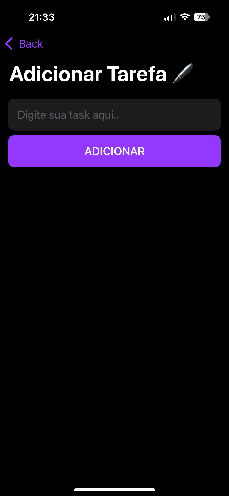
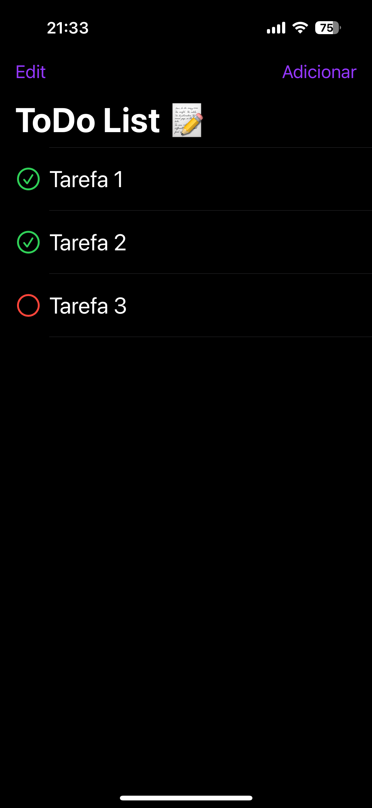

# ToDoList-App-iOS 📝

**Plataforma:** iOS 📱  
**Linguagem:** Swift 🦅  
**Licença:** MIT 📄

Uma aplicação simples de lista de tarefas (To-Do List) para iOS, desenvolvida em Swift. Permite adicionar, editar, deletar e marcar tarefas como concluídas, tornando o gerenciamento do dia a dia mais produtivo.

## Funcionalidades ✨

- ➕ Adição de novas tarefas
- ✏️ Edição e exclusão de tarefas existentes
- ✅ Marcação de tarefas como concluídas
- 🖌️ Interface intuitiva e responsiva

## Capturas de tela 📸

<!-- Adicione imagens do app aqui -->
<!-- Exemplo: -->
<p float="left">
  
  
  
</p>

## Instalação 🚀

Clone este repositório:

```sh
git clone https://github.com/Pedro-Lemos/ToDoList-App-iOS.git
```
Abra o projeto no Xcode (.xcodeproj ou .xcworkspace).
Execute o projeto em um simulador ou dispositivo físico.

## Requisitos ⚙️

- iOS 13.0 ou superior
- Xcode 12 ou superior
- Swift 5

## Como contribuir 🤝

1. Faça um fork do repositório
2. Crie uma branch para sua feature ou correção (`git checkout -b minha-feature`)
3. Commit suas alterações (`git commit -am 'Minha nova feature'`)
4. Faça o push para a branch (`git push origin minha-feature`)
5. Abra um Pull Request

## Licença 📄

Este projeto está sob a licença MIT. Veja o arquivo LICENSE para mais detalhes.

---

Desenvolvido por Pedro Lemos
